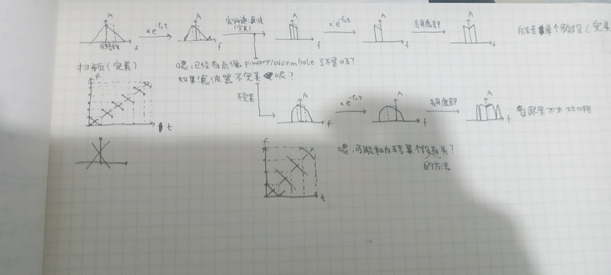
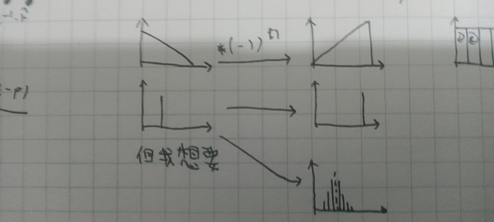
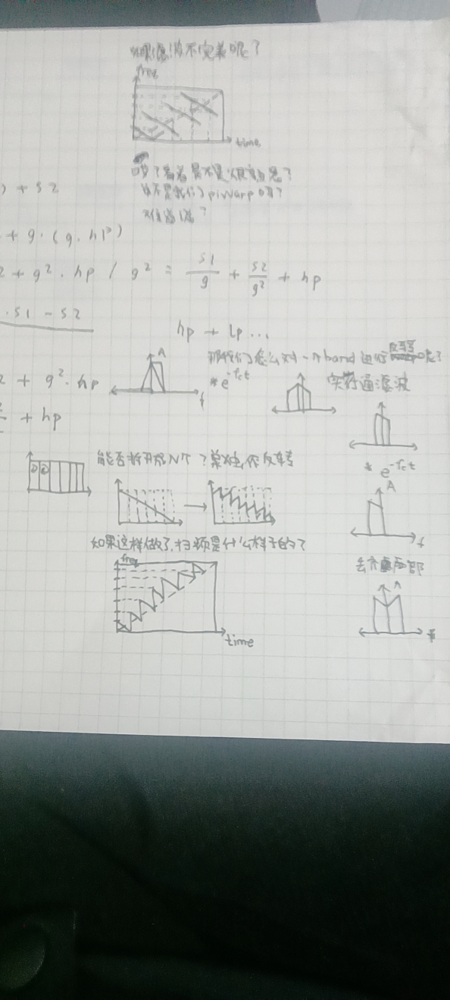

## 反转频谱
假设有一信号覆盖F_l~F_h，首先需要一个频率为 -(F_l + F_h)/2 的复正弦振荡器，将它们乘起来信号会向左移动，之后使用一个频率为 (F_l + F_h)/2 的实数低通滤波器，使得原来正频率边带的信号保留，然后乘以相同的复正弦振荡器，将信号向左移动，去除虚部让频谱镜像，成功反转信号。  
`参考资料`[Spectral Flipping Around Signal Center Frequency](https://www.dsprelated.com/showarticle/37.php)

## 多段频谱反转
把频谱分成不同的频段就能得到F_l~F_h，之后对每段进行反转，最后再合并起来。

## 一些头脑风暴？

